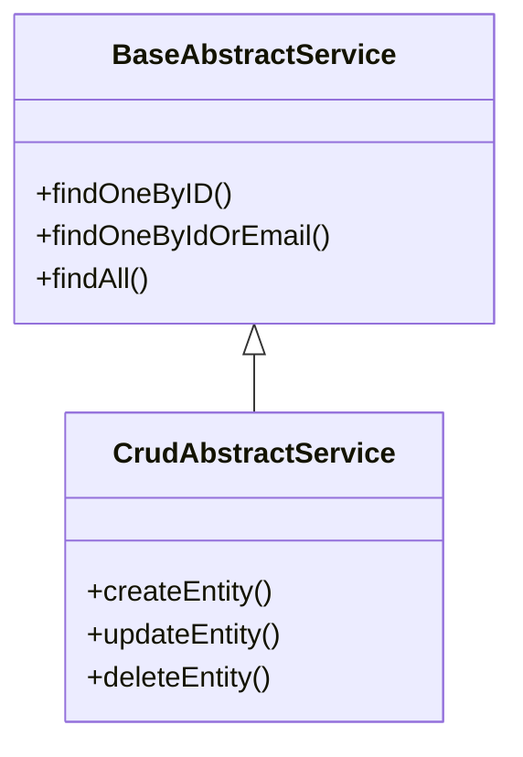

# **CRUD Abstraction System Documentation**

## **Overview**

This system provides a robust abstraction layer for CRUD operations in NestJS/TypeORM applications, eliminating code duplication across entity services. The architecture consists of two core abstract classes:

1. **`BaseAbstractService`** - Handles all read operations (R in CRUD)
2. **`CrudAbstractService`** - Extends base to add write operations (CUD in CRUD)

## **Why This System?**

### **Problem Solved**

- Eliminates repetitive CRUD code across entity services
- Ensures consistent implementation patterns
- Reduces maintenance overhead
- Provides built-in transaction support
- Enforces standardized error handling

### **Key Benefits**

✅ **Single Source of Truth** - All CRUD logic centralized in one place
✅ **Type Safety** - Full TypeScript support with generics
✅ **Transaction Ready** - Built-in support for both new and existing transactions
✅ **Optimized Queries** - Includes locking mechanisms and pagination
✅ **Consistent Errors** - Standardized error formats and HTTP status codes

## **Architecture**



## **Implementation Guide**

### **1. BaseAbstractService (Read Operations)**

```typescript
export abstract class MyEntityService extends BaseAbstractService<MyEntity> {
  constructor(repository: Repository<MyEntity>) {
    super(repository, 'MyEntityService');
  }

  // Optional: Add custom read methods
  async findActiveUsers(): Promise<MyEntity[]> {
    return this.repository.find({ where: { isActive: true } });
  }
}
```

### **2. CrudAbstractService (Full CRUD)**

```typescript
export abstract class MyEntityService extends CrudAbstractService<MyEntity> {
  constructor(repository: Repository<MyEntity>) {
    super(repository, 'MyEntityService');
  }

  // Optional: Override or extend default CRUD behavior
  async createEntity(data: DeepPartial<MyEntity>): Promise<MyEntity> {
    // Custom pre-create logic
    return super.createEntity(data);
  }
}
```

## **Key Features Explained**

### **Transaction Support**

All methods accept optional `EntityManager` parameter:

```typescript
// Using existing transaction
await manager.transaction(async (tx) => {
  await myService.createEntity(data, tx);
  await myService.updateEntity(id, changes, tx);
});

// Automatic new transaction
await myService.deleteEntity(id);
```

### **Pagination & Filtering**

```typescript
const result = await service.findAll({
  page: 1,
  limit: 20,
  filter: { status: 'active' }, // Type-safe filtering
});
```

### **Error Handling**

Consistent error patterns:

- `404 Not Found` for missing entities
- `409 Conflict` for constraint violations
- `400 Bad Request` for validation errors

## **Performance Considerations**

1. **Query Optimization**

- Pessimistic locking in transactions
- Smart WHERE clause generation
- Batch operations support

2. **Caching**

- Repository instances reused
- Transaction contexts preserved

3. **Memory Efficiency**

- Streamlined response objects
- No redundant data processing

## **Best Practices**

1. **Service Composition**

   ```typescript
   class UserService extends CrudAbstractService<User> {
     constructor(repo: Repository<User>) {
       super(repo, 'UserService');
     }

     // Add business logic methods
     async register(userData) {
       // Custom logic + standard CRUD
       return this.createEntity(userData);
     }
   }
   ```

2. **Transaction Chaining**

   ```typescript
   async complexOperation() {
     return this.repository.manager.transaction(async (tx) => {
       const a = await this.createEntity(dataA, tx);
       const b = await this.updateEntity(bId, changes, tx);
       return { a, b };
     });
   }
   ```

3. **Validation Layer**
   ```typescript
   async createEntity(data: DeepPartial<T>) {
     await this.validate(data); // Add custom validation
     return super.createEntity(data);
   }
   ```

## **Comparison: Traditional vs Abstracted CRUD**

| Aspect                  | Traditional Approach            | This System            |
| ----------------------- | ------------------------------- | ---------------------- |
| **Lines of Code**       | 100+ per entity                 | 10-20 per entity       |
| **Consistency**         | Varies by developer             | Enforced patterns      |
| **Maintenance**         | High (fixes in multiple places) | Low (single source)    |
| **Transaction Support** | Manual implementation           | Built-in               |
| **Onboarding**          | Steep learning curve            | Immediate productivity |

This abstraction system reduces boilerplate while maintaining flexibility, making it ideal for applications with numerous entities requiring standard CRUD operations with consistent quality.
